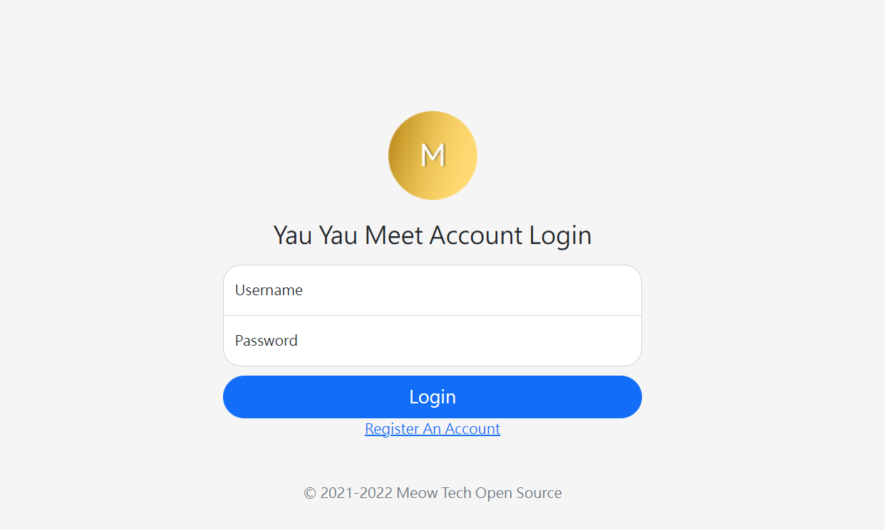

# Step2A: Logging in your account
You need to login to your account to access the meeting. After your registration, click the back button on your browser OR click the "I want to login instead button" to got to the login page.

## Note
If you are redirect to the Home Page after the login, you can skip to step 3 or read this part to learn how to login.

## Logging in with your username
After the login screen appears, you can type in your username and password and click "Login" to login to the system

## You are now well set for Step3
Move on forward to learn how to join a meeting.