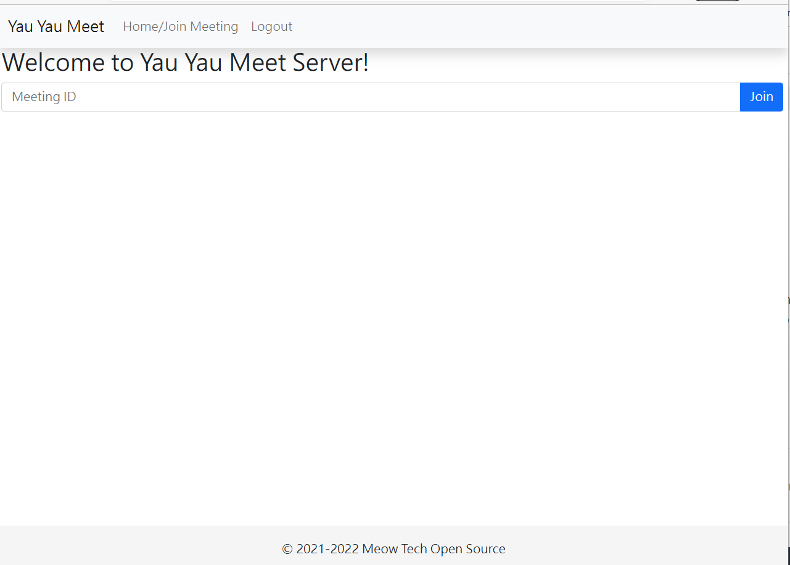
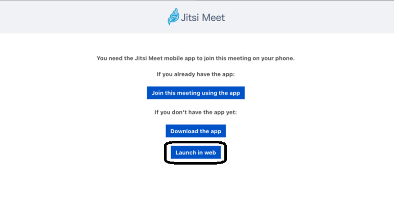

# Step3:Using the Interface
## Note
You must be added to a participant list of that meeting before joining a meeting. Please consult the server admin to learn more about the meeting.
## Home Page
This is your homepage, on top, there is a navbar. If the options are hidden click on the  button to see the options.

### Logging Off
Click on the "Logout" button on the navbar, you will be redirected to the login page where you can login again.

### Joining a meeting
Underneath the welcome text, you will see a textbox with a placeholder "Meeting ID", this is where you enter your meeting id, you can ask for your server admin to give you the ID to join.

Clicking on the "Join" button will redirect you into the joining page where you can join the meeting.

## Meeting App Page (Mobile/Tablet Only)
You may see a page asking you to download the app. DO NOT DO SO. It will not work as the Advanced encryption technology does not support the app.

Click on "Launch in Web" and move on to Step4

