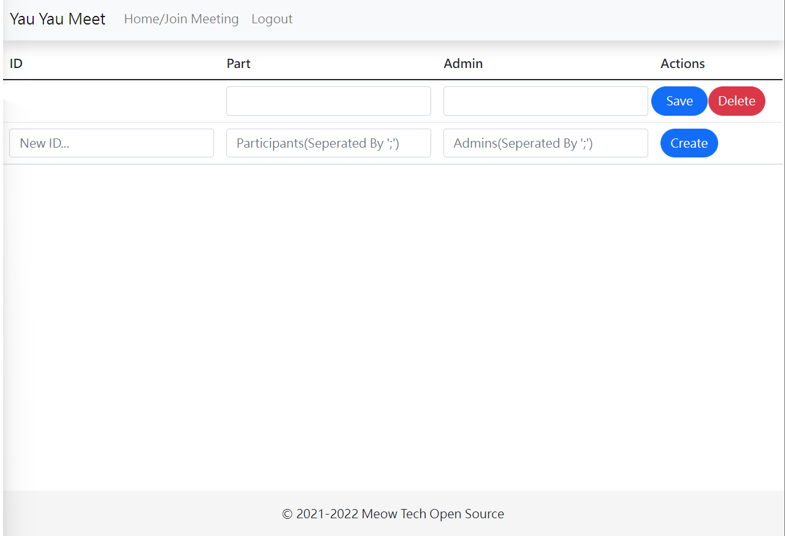

# Admin Area
After you login, go to /admin of the server.

## Add A Meeting
In the last item of sheet, type in a new id, and make a participant and admin list seperated by ';' symbol(username).

For Example:
`User1;User 2;User3;`

### Note
Admins cannot include users in Participant list

## Modify a meetings participants
Select the meeting you want and change the participants and admins. After your change, click the "Save" button in that row.

## Delete a meeting
Select the meeting you want and click the "Delete" button in that row.
