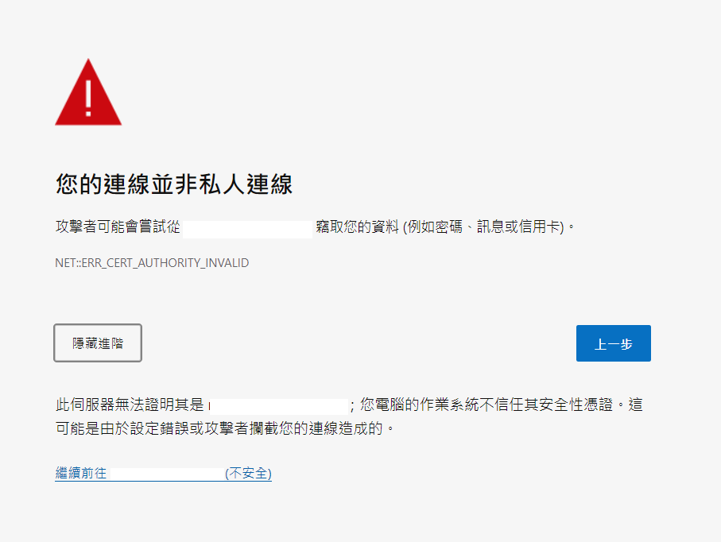
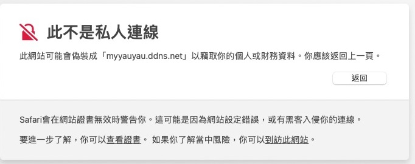
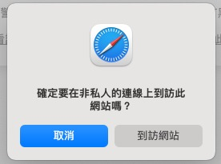

# Step1: Accepting SSL in ChromeOS/Android Tablet/Windows/macOS/Linux using Chromium based browser
## Note
If you are using Windows, Android Tablet Or Linux. We highly recommend you to choose a Chromium based browser. Other browsers are not supported.

If you are using macOS, we highly recommend you to choose Safari browser. Other browsers are not supported.
## Accepting SSL Certificate
### Chromium based
You must accept a ssl certificate error if it is using https.
* Please click ADVANCED, and CONTINUE TO {WEBSITE}.

### Safari
You must accept a ssl certificate error if it is using https.
Please click Advanced/More, and Visit this website.

In the dialog, select "visit website" again.

## Using the system
Please go to Step 2 of this documentation.