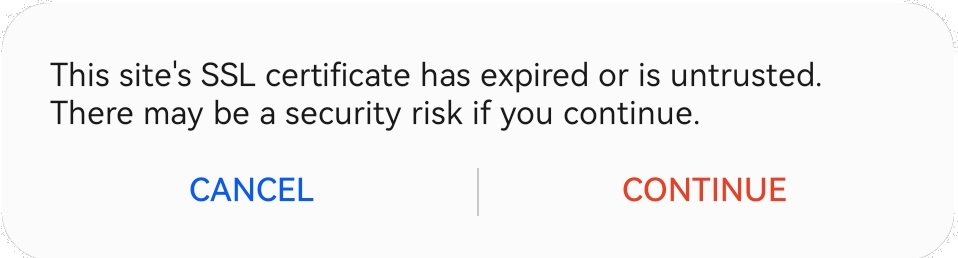

# Step1: Accepting SSL in HarmonyOS
## Accepting SSL Certificate
You must accept a ssl certificate error if it is using https.
* Please click CONTINUE, NOT CANCEL.

## Using the system
Please go to Step 2 of this documentation.