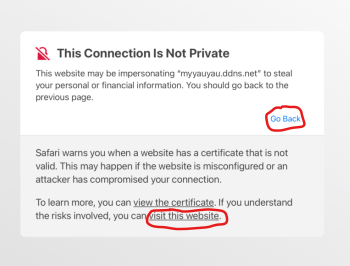

# Step1: Accepting SSL in iOS
## Accepting SSL Certificate
You must accept a ssl certificate error if it is using https.
* Please click advanced, NOT go back.

Then, click accept in the dialog

## Using the system
Please go to Step 2 of this documentation.