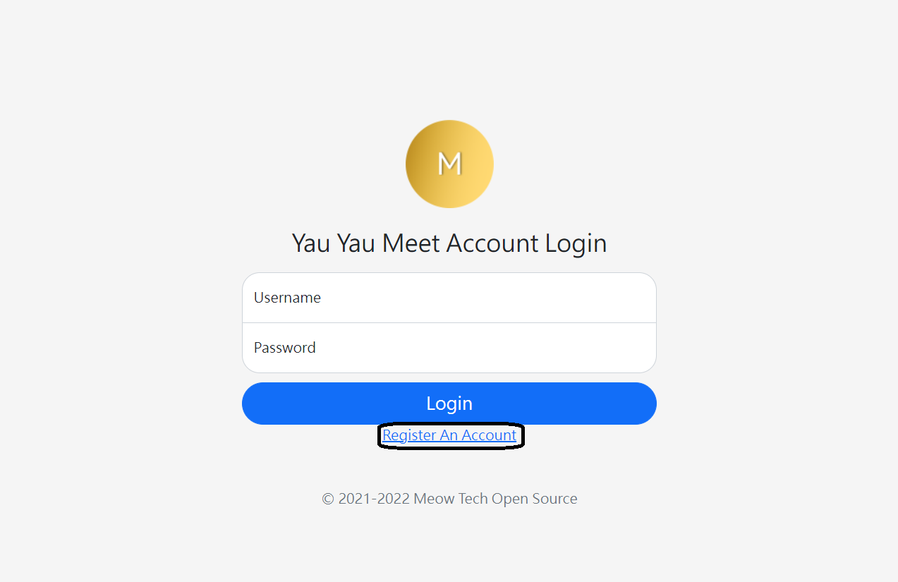
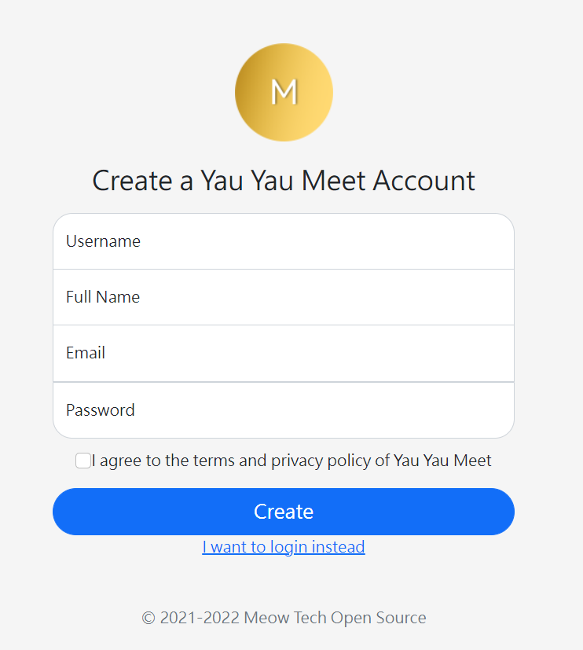

# Step2: Creating an account
You must create an account to join a meeting.
## Entering the register page
After you reach the login page, click on "Register An Account"

## Register Page
Fill in your details, such as username and Fullname. After that, read the terms and privacy policy of the platform. If you agree, please tick the checkbox. If not, please quit the website.

After all of the above, click on "Create"

## Create Success
If your creation is success, you will get a tiny "OK!" on your screen.

If not, please change your username as it is invalid OR there is someone already using your username.

## Tell your username to the server admin

Please tell your username to the admin to add you into the meeting.

## Go forward to Step2A
To login, follow step2A.