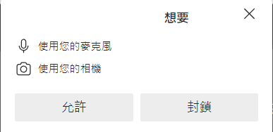
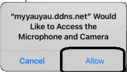
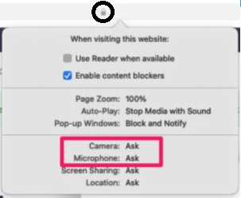
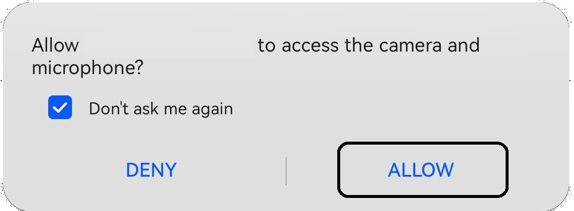
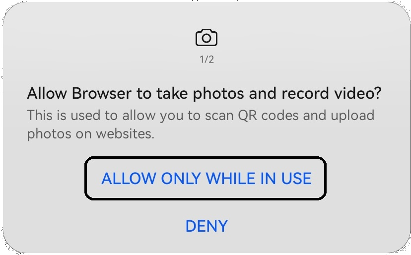
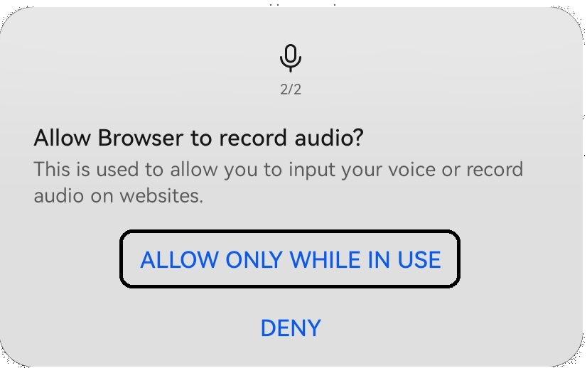

# Step4:Allowing camera and microphone
## Using Chromium based browsers in macOS, Windows and Linux
Simply click on allow and you are good to go.

### Antivirus
Please follow your antivirus vendor's guide if your camera access is banned by it
## Using Safari in iOS
Simply click on allow and you are good to go.

## Using Safari in macOS
Click on the lock icon next to the URL, a popup will appear. Click on "Ask" next to camera/Microphone and a dropdown will appear. Select enable or allow.

## Using HarmonyOS
Simply click on ALLOW, if you want, you can check the 'Don't ask me again' checkbox'

### Browser Permission Prompts
If there are permission prompts, please click on "ALLOW ONLY WHILE IN USE"

## Entering The Meeting/Waiting Room
You can move on to step 5