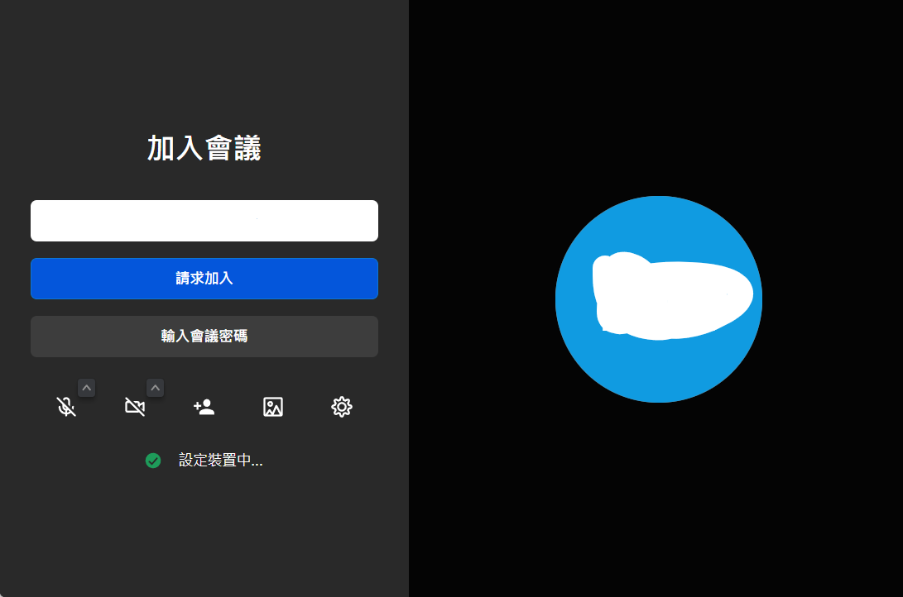

# Step5:Waiting Room/Meeting Interface
## Waiting Room
This is the waiting room, where the admin will wait you to enter the meeting, once you click "Request Entrance", your request will be send to the meeting admin. They will approve you and you will enter the meeting interface.

### Note
Do not change the nickname in the entrance page, the admin may not recognize you.

## Meeting Interface
This is the meeting interface. You can mute, turn on/off camera, chat, react, change view and see the members. Click on ... to see more options.

Most of the features you use is all in the main menu, if there isn't, select the ... menu.

# Congratulations!
You have grasps the main usage of Jitsi Meet and MeowMeet, enjoy!